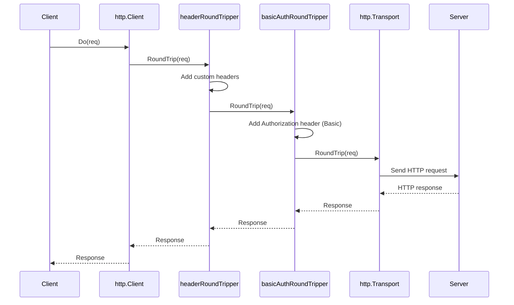

# RoundTripper

## Program Execution

```sh
$ go run .
[headerRoundTripper] before request sent
[basicAuthRoundTripper] before request sent
[basicAuthRoundTripper] after request sent
[headerRoundTripper] after request sent
200 OK
{
  "authenticated": true, 
  "user": "pskp"
}
```

## Sequence Diagram


