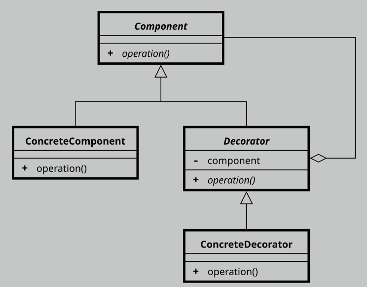

# Decorator

- It lets you attach new behaviors to objects by placing these objects inside wrapper objects that contain the behaviors.
- Adapter provides a completely different interface for accessing an existing object. On the other hand, with the Decorator pattern the interface either stays the same or gets extended.
- With Adapter you access an existing object via different interface. With Proxy, the interface stays the same. With Decorator you access the object via an enhanced interface.

